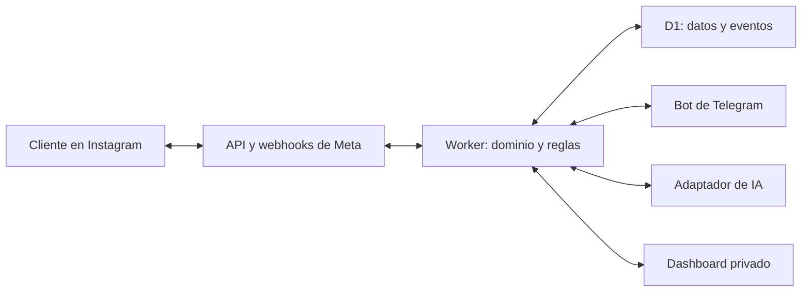

# MVP de atención y ventas: Instagram DM ↔ Telegram + IA + dashboard

**Estado:** plan de implementación e investigación · **Fecha de revisión:** 27 de septiembre de 2026 · **Objetivo económico:** operar dentro de planes gratuitos, sin contratar un intermediario de automatización. Este documento es la especificación inicial para un repositorio GitHub; no implica que las cuentas, permisos o despliegues ya existan.

## 1. Resultado esperado

Un cliente escribe por DM a una cuenta profesional de Instagram. La aplicación recibe el evento oficial de Meta, registra la conversación y la hora, clasifica la intención y prioridad, y prepara una respuesta con un proveedor de IA intercambiable. Si la respuesta supera las reglas de seguridad y calidad, se envía desde **la cuenta de Instagram**; si no, se solicita atención humana. Los empleados autorizados ven `/chats` en su chat privado con el bot de Telegram, toman una conversación y responden desde Telegram. El cliente recibe esa respuesta en **su DM de Instagram**. Un dashboard privado permite ver colas, horarios, triajes, resultados comerciales y desempeño de las variantes de respuesta.



**Alcance del MVP:** una cuenta de Instagram del negocio; mensajes de texto en la ida y vuelta; adjuntos entrantes se registran como evento con tipo y referencia si la API los expone, se muestran como aviso para el agente y se derivan a humano; no prometer envío de medios hasta validar cada tipo. Hasta ocho agentes en chats privados de Telegram. Dashboard de lectura y gestión de catálogo, triaje, variantes y resultados. IA generativa real en la ruta automatizada, con interruptor para pasar a aprobación humana o respuesta de contingencia. No se iniciarán DMs fríos ni campañas masivas.

**Definición de terminado:** desde una cuenta de cliente real se recibe un DM, queda en el historial con hora correcta, el bot o un humano lo responde en ese mismo DM, `/chats` refleja el estado, dos agentes no pueden tomar el mismo chat, el dashboard muestra métricas congruentes con los eventos y una variante de IA puede etiquetarse y compararse con una conversión confirmada. El sistema sigue seguro cuando IA, Meta o Telegram fallan.

## 2. Investigación confirmada y decisiones

| Tema | Hallazgo y efecto en el diseño | Fuente oficial |
|---|---|---|
| Instagram | La ruta elegida es **Instagram API with Instagram Login** para una cuenta profesional Business o Creator. No se presupone Facebook Page en esta ruta; se debe verificar el flujo concreto al configurar la app. Los permisos iniciales a solicitar son `instagram_business_basic` y `instagram_business_manage_messages`. | [Meta: Instagram Login](https://developers.facebook.com/documentation/instagram-platform/instagram-api-with-instagram-login/), [Meta: Business Login](https://developers.facebook.com/documentation/instagram-platform/instagram-api-with-instagram-login/business-login/) |
| Mensajería | La API permite responder a un usuario que ya inició la conversación. El envío usa el ID de destinatario de Instagram asociado a la conversación; no el username visible. Validar la versión vigente de Graph API y el cuerpo exacto contra la documentación en la fase de integración. | [Meta: Send Messages](https://developers.facebook.com/documentation/instagram-platform/instagram-api-with-instagram-login/messaging-api), [Meta: colección oficial de Postman](https://www.postman.com/meta/instagram/folder/23987686-98bfade9-3736-4738-8b4a-f56d6534f6de) |
| Historial | Además de webhooks existe una Conversations API para listar conversaciones y mensajes. `/chats` usará la base local y ofrecerá una sincronización inicial/conciliación autorizada. No prometer que recuperará absolutamente todo el histórico de Instagram: verificar límites de acceso, paginación y disponibilidad antes de anunciar importación completa. | [Meta: Get Conversations](https://developers.facebook.com/documentation/instagram-platform/instagram-api-with-instagram-login/conversations-api), [Meta: Postman](https://www.postman.com/meta/instagram/request/23987686-a1932608-1ed8-4afc-aeee-1f1b9851525a) |
| Eventos | Hay que verificar el callback HTTPS, suscribir campos pertinentes (`messages` y, cuando se usen botones, `messaging_postbacks`) y suscribir la cuenta profesional a la app. Validar firma SHA-256 sobre el cuerpo crudo antes de procesar. | [Meta: Setup Webhooks](https://developers.facebook.com/documentation/instagram-platform/webhooks), [Meta: suscribir la cuenta](https://www.postman.com/meta/instagram/folder/23987686-ec43ac03-c31a-4e27-aa68-a761944c646a), [Meta: validación de payloads](https://developers.facebook.com/documentation/business-messaging/messenger-platform/webhooks) |
| Ventana | La ventana normal de respuesta es de **24 horas desde el último mensaje del cliente**. La extensión de agente humano, si está disponible/habilitada para esta integración y conforme a la política vigente, llega hasta **7 días** y exige respuesta humana genuina; nunca la IA. El sistema recalcula elegibilidad justo antes de cada envío. Fuera de ventana, conserva el caso pendiente y espera un nuevo mensaje del cliente. | [Meta: política de mensajería](https://developers.facebook.com/documentation/business-messaging/messenger-platform/policy), [Meta: Instagram Messaging Overview](https://developers.facebook.com/documentation/business-messaging/instagram-messaging/overview) |
| Permisos en vivo | Los niveles Standard/Advanced y App Review dependen de la relación de la cuenta con la app y del uso. No dar por hecho que una prueba con administradores autoriza DMs de cualquier cliente real. El *gate* es una prueba con un usuario externo legítimo y, si Meta la exige, revisión/aprobación antes de habilitar producción. | [Meta: niveles de acceso](https://developers.facebook.com/docs/graph-api/overview/access-levels/), [Meta: plataforma](https://developers.facebook.com/documentation/instagram-platform/overview) |
| Telegram | `getUpdates` y webhook son excluyentes; se usará webhook HTTPS en el mismo Worker. Telegram entrega `update_id`, botones inline y callbacks. La respuesta del empleado se vincula mediante **Reply** a un mensaje del bot que contiene el contexto de la conversación. | [Telegram Bot API](https://core.telegram.org/bots/api) |
| Hosting | Workers Free dispone de 100.000 solicitudes/día y límite de CPU por invocación; D1 Free tiene 5 millones de filas leídas/día, 100.000 escritas/día y 500 MB por base de datos. `workers.dev` da URL HTTPS sin comprar dominio, pero Cloudflare la considera orientada a proyectos no críticos. Los excesos del plan gratuito provocan errores; no prometer disponibilidad contractual. | [Workers pricing](https://developers.cloudflare.com/workers/platform/pricing/), [D1 pricing](https://developers.cloudflare.com/d1/platform/pricing/), [D1 limits](https://developers.cloudflare.com/d1/platform/limits/), [workers.dev](https://developers.cloudflare.com/workers/configuration/routing/workers-dev/) |
| IA inicial | Workers AI ofrece una asignación gratuita de 10.000 Neurons/día a la fecha de revisión. El consumo depende del modelo, entrada y salida; instrumentar el gasto y cortar antes del límite. El proveedor predeterminado será Workers AI, reemplazable por otro adaptador. | [Workers AI pricing](https://developers.cloudflare.com/workers-ai/platform/pricing/) |
| Frontend y CI | Los assets estáticos pueden viajar con el Worker. GitHub Actions ofrece ejecución gratuita en repos públicos y una cuota incluida en privados; fijar presupuesto y no activar servicios pagados por accidente. | [Static Assets](https://developers.cloudflare.com/workers/static-assets/), [GitHub Actions billing](https://docs.github.com/en/actions/concepts/billing-and-usage) |

**Hipótesis que deben comprobarse en la cuenta real:** revisión de Meta y visibilidad de DMs de clientes fuera de roles de prueba; campos concretos de los webhooks; si la función Human Agent está autorizada; límites de la Conversations API; acceso a mensajes originados en la app nativa u otras herramientas; consentimiento y disponibilidad de ciertos datos de perfil. Registrar resultado y capturas **sin datos personales** en `docs/meta-validation.md`. Si una hipótesis bloquea el uso real, no se sustituye por scraping ni por automatización de la interfaz de Instagram.

## 3. Costo US$0 y arquitectura elegida

**Repositorio privado de GitHub** para código, documentación e issues; **Cloudflare Worker + D1 + Static Assets** para backend, base y dashboard; **Telegram Bot API**; **Meta Instagram API**; **Workers AI** como implementación predeterminada. No se necesita Zapier, Make, ManyChat ni un servidor encendido en casa. Configuración local con Wrangler y D1 local para desarrollo.

| Recurso | Uso inicial | Regla de costo |
|---|---|---|
| Meta + Telegram | Integraciones directas | Revisar permisos, políticas y límites; no contratar integradores. |
| Worker, D1, assets | Webhooks, API, almacenamiento, panel | Mantener plan Free, alertas de uso y operaciones acotadas. La persistencia de texto consume D1; no descargar ni almacenar adjuntos en el MVP. |
| Workers AI | Respuestas generadas | Límite diario interno configurable, tamaño máximo de contexto, máximo de tokens, modelo económico y apagado automático al acercarse al cupo. |
| GitHub | Git, issues, CI | Repo privado; verificar la cuota de Actions. Ningún token en commits o logs. |
| Dominio | URL `*.workers.dev` | US$0, con la limitación operativa indicada arriba; dominio propio sería opcional y probablemente no gratuito. |

**No hay garantía universal de US$0:** el volumen, cambios de precios, aprobación de cuentas y consumo de IA pueden forzar reducir funcionalidad, pasar a atención humana o pagar después. El comportamiento del MVP ante cuota agotada será explícito: pausar IA, mantener mensajes entrantes y notificar a agentes; si D1 o Worker fallan por cuota, registrar incidencia y restaurar servicio cuando vuelva el cupo. No prometer una respuesta automática si el almacenamiento falló.

## 4. Estructura del repositorio y diseño de código

```text
/
  README.md
  docs/
    plan-mvp-instagram-telegram-ia.md
    meta-validation.md
    runbook.md
    data-policy.md
    adr/
  src/
    domain/             # entidades, estados, reglas puras
    application/        # casos de uso; dependencias por interfaces
    ports/              # InstagramGateway, TelegramGateway, AiProvider, repositorios
    adapters/
      meta/
      telegram/
      ai/               # workers-ai, external-http, fake
      d1/
    http/               # rutas, autenticación, serialización
    jobs/               # outbox, conciliación, métricas, cupos
  dashboard/            # SPA estática, sin secretos en el navegador
  migrations/           # SQL versionado
  tests/                # dominio, contratos, integraciones, E2E simulados
  .github/workflows/     # typecheck, lint, test, build; deploy controlado
  wrangler.jsonc
  .env.example           # nombres de variables, jamás valores reales
```

TypeScript estricto, validación de payloads en fronteras, inyección por constructor/fábricas y módulos con una responsabilidad. El dominio desconoce el SDK de Cloudflare, Telegram y Meta. Los casos de uso dependen de interfaces pequeñas: `ReceiveCustomerMessage`, `ClassifyLead`, `GenerateReply`, `ClaimConversation`, `SendAgentReply`, `RecordOutcome`, `BuildDashboardMetrics`. No agregar una capa genérica sin caso de uso real. Versionar contratos, migraciones y prompts. Bloquear merge con formato, lint, `tsc`, pruebas y build.

**Puertos clave:**

```ts
interface AiProvider {
  generate(input: {
    messages: Array<{ role: 'system' | 'user' | 'assistant'; content: string }>;
    model: string;
    maxOutputTokens: number;
    temperature: number;
  }): Promise<{ text: string; providerRequestId?: string; usage?: Record<string, number> }>;
}
interface InstagramGateway {
  sendText(input: { accountId: string; recipientId: string; text: string;
    humanAgent?: boolean }): Promise<{ messageId: string }>;
}
```

El adaptador `workers-ai` es la elección inicial y `external-http` admite otro proveedor configurado mediante endpoint, credenciales y mapeo explícito de formato; la interfaz no presupone que todas las APIs sean compatibles. `fake` sirve para pruebas. Un modelo local **no** puede ser llamado por un Worker alojado si solo escucha en `localhost`; para producción necesita un endpoint HTTPS accesible y seguro, con consecuencias para costo/disponibilidad. Selector `AI_PROVIDER=workers-ai|external-http|disabled`; `disabled` deriva a agentes o respuesta determinista aprobada. El modelo y sus parámetros se configuran sin cambios en dominio.

## 5. Flujo operacional y estados

1. `GET /webhooks/meta`: validar `hub.mode`, `hub.verify_token` y devolver `hub.challenge`. `POST`: limitar tamaño, comprobar `X-Hub-Signature-256` con comparación segura sobre bytes crudos, persistir evento e identificador único y responder rápido; procesar luego con trabajo diferido/cron sin depender de ejecución larga.
2. Extraer cuenta destino, ID de cliente, ID del mensaje, timestamp, texto/tipo; rechazar ecos propios y eventos que no sean mensajes entrantes. Deduplicar por ID externo y registrar tipo desconocido sin inventar contenido.
3. Crear/actualizar cliente, conversación y mensaje en una transacción o conjunto atómico apropiado. `received_at_utc` usa tiempo de Meta; `ingested_at_utc` mide retraso. `last_customer_message_at_utc` abre/reabre la ventana.
4. Clasificar triaje. Si pasa a humano, avisar a los agentes con un botón de toma. Si está en `BOT` y es elegible, generar borrador IA con hechos aprobados, validar salida y pasar al outbox de envío. Si hay duda, presupuesto agotado o información sensible, pasar a `PENDING_HUMAN`.
5. Antes de enviar, releer estado, asignación y último mensaje del cliente; comprobar ventana permitida. Persistir intento. Ante éxito de Meta, guardar `message_id`, texto y exposición de variante; ante error, registrar razón. Ante *timeout* de resultado incierto, conciliar antes de reintentar para evitar doble respuesta.
6. En `HUMAN`, solo el agente asignado puede enviar. Su Telegram **Reply** debe apuntar a un mensaje del bot registrado en `telegram_message_links`; nunca resolver destino solo por “chat activo”. Revalidar permisos, modo, asignación y ventana al momento del envío; devolver confirmación o error al agente.
7. Al cerrar, pedir resultado (`venta_confirmada`, `sin_venta`, `seguimiento`, `no_determinado`) y, para venta, importe y moneda opcionales con evidencia/nota. Liberar asignación. Un nuevo DM crea ciclo de atención o reabre conversación según política; no enviar mensajes proactivos fuera de ventana.

**Estados:** `BOT`, `PENDING_HUMAN`, `HUMAN`, `CLOSED`; razón separada (`requested_human`, `low_confidence`, `complaint`, `ai_unavailable`, `window_expired`, etc.). Toma atómica con `UPDATE ... WHERE mode='PENDING_HUMAN' AND assigned_employee_id IS NULL`, comprobar filas afectadas. Cambio a `HUMAN` suspende trabajos IA; los trabajos atrasados verifican versión de conversación y se descartan. Cierre o transferencia genera evento de auditoría.

**Telegram:** `/start` verifica `from.id` contra allowlist de empleados activos; `/chats` filtra, pagina y muestra pendientes, bot y atendidos; `/mischats`; `/cerrar` exige conversación explícita o Reply; botones `Ver`, `Tomar`, `Transferir`, `Cerrar`, `Marcar venta`. Restringir a chat privado y a la identidad Telegram del empleado. Resolver cada callback con token opaco corto almacenado, validar agente y estado; confirmar callback con `answerCallbackQuery`. Para varios mensajes simultáneos, crear una tarjeta de contexto por conversación y enlazar cada tarjeta y notificación a su `conversation_id`; incluir nombre y resumen antes del envío. Ocultar datos innecesarios en avisos.

## 6. Triaje y horarios

Cada mensaje entrante almacena UTC y se presenta en `America/Santo_Domingo`. Guardar siempre la zona IANA asociada al negocio, además del timestamp UTC; nunca derivar el horario de llegada desde la hora del servidor. Análisis por hora local (0–23), día de la semana, fecha local, horario laboral configurable, primera respuesta, espera hasta humano y tiempo hasta cierre. Distinguir clientes únicos, conversaciones y mensajes para que una persona que envía diez mensajes no cuente como diez leads.

| Campo | Valores iniciales | Regla |
|---|---|---|
| `intent` | `precio`, `disponibilidad`, `pedido`, `envio`, `postventa`, `reclamo`, `saludo`, `otro` | Clasificación por IA con esquema validado; reglas de palabras clave como respaldo; el agente puede corregir. |
| `stage` | `nuevo`, `interesado`, `objecion`, `listo_para_comprar`, `posventa` | Evidencia textual guardada; no deducir una venta solo porque el cliente dice “gracias”. |
| `priority` | `alta`, `media`, `baja` | Alta para reclamos, pago fallido, intención clara de compra o solicitud de humano; editable. |
| `triage_source` | `ai`, `rule`, `human` | Guardar versión y confianza cuando aplique. |
| `needs_human` | booleano + motivo | Petición expresa del cliente, tema no resuelto, riesgo, incertidumbre o falla. |

Dashboard de triaje: cola ordenada por prioridad, antigüedad y plazo de ventana; filtros por intención, etapa, agente y horario; distribución de ingresos por hora local y “fuera de horario”; tabla de conversaciones con último mensaje y próxima acción. Opcional: horario de negocio y SLA configurables; nunca hacer que horario comercial invalide una ventana de Meta.

## 7. IA orientada a ventas y medición honesta

**Entrada aprobada:** catálogo con producto, precio, moneda, stock/estado, condiciones de entrega, horarios y políticas; instrucciones de tono; últimos mensajes relevantes con redacción/minimización de datos personales. El proveedor responde en JSON validado: `intent`, `stage`, `priority`, `needs_human`, `proposed_text`, `reason_code`, `catalog_ids_used`, `confidence`. Salida inválida o sin respaldo en catálogo → revisión humana. No inventar descuentos, existencia, plazos, garantías ni enlaces. No pedir contraseñas ni tarjetas. Indicar cuando el cliente conversa con una asistencia automatizada conforme a la política del negocio.

**Control inicial:** activar `AI_MODE=review` durante pruebas reales, con aprobación del agente; pasar a `auto` solo para intenciones y umbrales configurados después de una muestra revisada. `AI_MODE=off` preserva atención humana. Registrar decisión y versión de prompt/modelo; limitar a una respuesta automática por ráfaga (debounce corto), y detener respuestas si el cliente pide persona o hay agente asignado.

| Estado de variante | Significado operativo |
|---|---|
| `no_probada` | Redactada/aprobada, sin envíos reales. |
| `en_prueba` | Enviada; resultado aún no maduro o muestra insuficiente. |
| `efectiva` | El responsable la marcó tras observar resultados con denominador visible y definición de conversión. |
| `ignorada` | Envíos maduros sin respuesta del cliente dentro de 24 h; es señal de interacción, **no** prueba causal de mala calidad. |
| `necesita_revision` | Baja respuesta, errores, correcciones humanas, promesas no respaldadas o queja. |
| `archivada` | No se usa para nuevas respuestas; se conserva el historial. |

**Unidad de análisis:** `response_variant` = intención + objetivo comercial + versión de prompt + versión de catálogo + estrategia/modelo. Cada texto generado pertenece a una variante y tiene un registro `ai_response_exposure` solo cuando Meta confirma envío. Guardar `sent_at`, `customer_replied_at`, `human_took_over_at`, `conversion_at`, `outcome_source`, costo estimado, motivo de bloqueo y si era exposición elegible. Múltiples textos únicos no deben crear variantes artificiales que hagan imposible comparar.

**Métricas por variante:** envíos confirmados, respuestas dentro de 24 h, solicitudes de agente, conversaciones que llegaron a `venta_confirmada`, importe confirmado opcional, quejas y latencia. Fórmulas explícitas: `reply_rate = conversaciones con respuesta / conversaciones expuestas maduras`; `confirmed_conversion_rate = ventas confirmadas / conversaciones expuestas maduras`. Mostrar numerador, denominador, periodo y segmento de intención; excluir casos sin ventana de observación completa. Una venta marcada por agente es dato declarado, no prueba de pago. Evitar atribuir toda venta al último texto: registrar exposición de todos los mensajes y reportar atribución descriptiva; una prueba A/B con asignación aleatoria por conversación y volumen suficiente puede añadirse sin mezclar variantes en un mismo chat. El estado `efectiva` es una decisión humana apoyada por datos, no una inferencia automática por una sola venta.

## 8. Modelo mínimo de datos

- `ig_accounts(id, ig_user_id, status, token_reference, last_token_check_at, created_at)`; los tokens reales van en secretos cifrados del entorno, no en D1 en texto plano.
- `employees(id, telegram_user_id UNIQUE, display_name, role, active, created_at)`.
- `customers(id, ig_account_id, ig_scoped_id, display_name_nullable, created_at)` con `UNIQUE(ig_account_id, ig_scoped_id)`.
- `conversations(id, ig_account_id, customer_id, mode, assigned_employee_id, priority, intent, stage, version, last_customer_message_at_utc, last_message_at_utc, opened_at_utc, closed_at_utc)`.
- `messages(id, conversation_id, external_message_id UNIQUE nullable, direction, origin [instagram|telegram|ai], body, content_type, provider_timestamp_utc, ingested_at_utc, delivery_status, reply_to_message_id)`.
- `webhook_events(id, provider, external_event_key UNIQUE, received_at_utc, process_status, attempts, error_code, payload_minimal)`; retención corta del payload crudo.
- `outbox(id, conversation_id, operation, payload_minimal, status, retry_at_utc, attempts, remote_message_id, created_at_utc)`; índices por estado/plazo.
- `triage_events(id, conversation_id, message_id, intent, stage, priority, needs_human, source, confidence_nullable, model_version_nullable, created_at_utc)`.
- `response_variants(id, name, intent, objective, prompt_version, catalog_version, provider, model, status, approved_by, created_at_utc)`.
- `ai_response_exposures(id, variant_id, message_id UNIQUE, conversation_id, sent_at_utc, customer_replied_at_utc_nullable, human_takeover_at_utc_nullable, mature_at_utc, token_usage_nullable, cost_estimate_nullable)`.
- `outcomes(id, conversation_id, kind, amount_minor_nullable, currency_nullable, evidence_note_nullable, recorded_by, recorded_at_utc)`.
- `telegram_message_links(employee_id, telegram_chat_id, telegram_message_id, conversation_id, created_at_utc)`; clave compuesta por chat y mensaje.
- `catalog_items(...)`, `business_settings(...)`, `audit_events(actor, action, entity, before_redacted, after_redacted, at_utc)` y `dashboard_sessions(token_hash, employee_id, expires_at_utc, revoked_at_utc)`.

Usar migraciones incrementales, claves foráneas, índices en `last_message_at_utc`, `(mode, priority)`, `provider_timestamp_utc`, `(variant_id, sent_at_utc)` y `(customer_id, ig_account_id)`. No registrar nombres de usuario como identificador estable. Definir borrado/retención configurable de mensajes y eventos, exportación y corrección. Un backup/restore probado es requisito operativo: D1 Time Travel Free tiene ventana limitada; descargar copias cifradas de forma periódica en un destino controlado por el dueño y probar recuperación, sin publicar datos en GitHub.

## 9. Dashboard y seguridad

Rutas: `/app` (SPA), `/api/overview`, `/api/conversations`, `/api/conversations/:id`, `/api/triage`, `/api/response-variants`, `/api/outcomes`, `/api/settings`, `/auth/consume`; webhooks separados `/webhooks/meta` y `/webhooks/telegram`.

- **Inicio:** conversaciones nuevas/pendientes, SLA, ventanas por vencer, ventas confirmadas, mensajes por hora/día local y tasa de respuesta.
- **Cola:** búsqueda y filtros, detalle cronológico, triaje editable, asignación, historial de decisiones de IA y errores de entrega.
- **IA y ventas:** tabla de variantes con estados, numeradores/denominadores, filtros de intención y periodo, textos anonimizados, aprobación/pausa, relación con resultados.
- **Configuración:** empleados/roles, catálogo, horario, prompt y proveedor/modelo, modo IA y límites de consumo.

**Login sin proveedor de identidad adicional:** un empleado autorizado escribe `/panel` y recibe un enlace de un solo uso que vence pronto. `GET` muestra confirmación sin consumir; `POST /auth/consume` intercambia el código por cookie `HttpOnly; Secure; SameSite=Strict`, rota el token y redirige a URL sin código. Hash del token en D1; revocación al desactivar empleado; `Referrer-Policy: no-referrer`, CSP estricta, ninguna analítica externa, CSRF para mutaciones, rate limit de login, expiración y roles (`owner`, `agent`, `viewer`). El bot debe ser contactado primero por cada empleado para poder recibir avisos. No exponer dashboard ni APIs de datos por la URL pública sin autenticar.

Secretos: `META_APP_SECRET`, `META_VERIFY_TOKEN`, token de Instagram, `TELEGRAM_BOT_TOKEN`, secreto del webhook Telegram y, si aplica, clave de proveedor IA. Guardarlos como secretos de Worker y GitHub Actions, nunca en `wrangler.jsonc`, frontend, SQL, URL, logs o capturas. Comprobar origen del webhook Telegram con el encabezado secreto y la identidad `from.id`; comprobar HMAC del webhook Meta. Redactar PII en logs; cifrar exportaciones; gestionar acceso y retención conforme a los términos aplicables de Meta/Telegram y a la normativa local que corresponda antes del uso comercial. Informar a clientes del uso de IA y tratamiento de sus mensajes según la política del negocio.

## 10. Construcción paso por paso y commits atómicos

Cada fila es un PR/commit pequeño con criterio de aceptación verificable. Convención `feat:`, `fix:`, `test:`, `docs:`, `chore:`; ramas cortas, revisión de diff y sin secretos. El dueño solo interviene en pasos marcados **TU ACCIÓN**; la implementación, documentación y pruebas pueden prepararse antes de esos puntos.

| # | Entrega y ejemplo de commit | Verificación / intervención |
|---:|---|---|
| 0 | `docs: define MVP, riesgos y criterios de aceptación` | Congelar alcance; registrar decisiones en ADR. **TU ACCIÓN:** indicar nombre de la cuenta y negocio, catálogo/precios/políticas y horario de atención; también quiénes serán los agentes. Puede usarse un catálogo de prueba hasta recibirlos. |
| 1 | `chore: initialize TypeScript Worker, D1, dashboard and CI` | Build, lint, typecheck y prueba en local; repo privado GitHub. **TU ACCIÓN:** crear/vincular GitHub y Cloudflare o conceder acceso con el mecanismo oficial; nunca enviar contraseñas o tokens por chat. |
| 2 | `feat: add domain states and D1 migrations` | Migración local, índices, pruebas de estados y toma simultánea. |
| 3 | `feat: verify Meta webhook and persist inbound events` | Challenge, firma válida/inválida, duplicados, ecos y múltiples eventos; endpoint HTTPS desplegado. **TU ACCIÓN:** crear app Meta, poner cuenta en modo profesional y autorizar la cuenta en la pantalla oficial. |
| 4 | `feat: connect Instagram conversations and send text` | DM de cuenta de prueba → D1 → respuesta en **ese mismo chat**; reconciliar límites e historial. **TU ACCIÓN:** hacer un mensaje de prueba desde otra cuenta; completar App Review si Meta lo requiere. Gate de producción. |
| 5 | `feat: authorize Telegram agents and browse chats` | `/start`, `/chats`, paginación, acceso denegado y callback obsoleto. **TU ACCIÓN:** crear bot en BotFather y pasar el token por secretos del despliegue; pedir a empleados iniciar el bot una vez y registrar sus IDs verificados. |
| 6 | `feat: implement atomic claim and reply routing` | Dos agentes compiten: uno gana; Reply correcto → destinatario correcto; Telegram informa éxito/error; IA no responde en `HUMAN`. |
| 7 | `feat: add triage and local-time analytics` | Comparar UTC y Santo Domingo; prioridad, corrección manual, horarios y SLA. |
| 8 | `feat: add provider-agnostic AI and safe sales replies` | Adaptadores fake/Workers AI/HTTP; catálogo respaldado, esquema, revisión y corte de cupo; pruebas de rechazo. **TU ACCIÓN:** aprobar catálogo, tono y primeras respuestas; activar modo automático cuando el piloto pase. |
| 9 | `feat: track variants, exposures and sales outcomes` | Exposición solo tras confirmación Meta, ventanas maduras, etiquetado y venta humana, métricas sin doble conteo. |
| 10 | `feat: build protected monitoring dashboard` | `/panel`, roles, filtros, tablas y gráficas consistentes con SQL, sin datos accesibles anónimamente. |
| 11 | `fix: harden retries, observability and recovery` | Simular errores 429/5xx, cuota IA, webhook duplicado, caída del proveedor, expiración de sesión y recuperación de backup. |
| 12 | `docs: add deployment runbook and launch checklist` | Deploy controlado, migraciones, secretos, rollback, prueba externa y registro de restricciones efectivas de Meta. **TU ACCIÓN:** autorizar puesta en vivo y confirmar que la cuenta real recibe DMs del público. |

**CI:** en PR ejecutar `npm ci`, `npm run lint`, `npm run typecheck`, `npm test`, `npm run build`; revisión de dependencias y escaneo de secretos. Deploy solo desde rama protegida mediante credencial de alcance mínimo; migración antes de activar código que dependa de ella; rollback de Worker y plan de reversión de datos. Commits separados para refactor, migración y cambio funcional cuando puedan revisarse de forma independiente. No mezclar credenciales con ejemplos de pruebas.

**Pruebas prioritarias:** contrato de webhook real anonimizado; deduplicación/reordenamiento; toma concurrente; ventana 24 h al borde exacto y ruta humana solo si la función está habilitada; Reply a tarjeta ajena o antigua; cambio BOT→HUMAN durante generación IA; acuse incierto de Meta sin duplicar envío; cálculo local de hora; definición de denominador y atribución; autorización y filtración por rol. E2E con mocks para CI; humo con cuentas reales después de la configuración autorizada.

## 11. Operación y decisiones pendientes

- **Diario:** vigilar eventos pendientes, errores Meta/Telegram, token de Instagram, cupo Worker/D1/IA, mensajes sin respuesta y casos cerca de cierre de ventana. Alertar a `owner` por Telegram si hay fallos persistentes; si Telegram falla, mostrar alerta en dashboard.
- **Semanal:** revisar triajes corregidos, variantes marcadas ignoradas, ventas confirmadas, sesgos por horario, backup y reintentos; actualizar catálogo/versiones y documentar ajustes.
- **Incidentes:** `AI_MODE=off` para detener IA; si Meta no entrega o la ventana venció, mostrar estado al agente y pedir que espere el próximo mensaje del cliente; no enviar por rutas no oficiales. Si token revocado, reconectar por OAuth y revalidar suscripción. `docs/runbook.md` tendrá comandos exactos y responsables tras conocer IDs y configuración reales.
- **Decisiones comerciales mínimas que debe proporcionar el dueño:** cuenta profesional, catálogo y política de precios/entrega, horario, qué significa “venta confirmada” y lista de agentes. Se pueden implementar pantallas y pruebas con datos ficticios mientras tanto. La activación productiva requiere además permisos reales de Meta y credenciales ingresadas por el dueño en interfaces oficiales.

## 12. Referencias de implementación

1. [Meta Instagram API with Instagram Login](https://developers.facebook.com/documentation/instagram-platform/instagram-api-with-instagram-login/) · [Messaging API](https://developers.facebook.com/documentation/instagram-platform/instagram-api-with-instagram-login/messaging-api) · [Conversations API](https://developers.facebook.com/documentation/instagram-platform/instagram-api-with-instagram-login/conversations-api) · [Webhooks](https://developers.facebook.com/documentation/instagram-platform/webhooks).
2. [Meta Messaging Policy](https://developers.facebook.com/documentation/business-messaging/messenger-platform/policy) · [Access Levels](https://developers.facebook.com/docs/graph-api/overview/access-levels/) · [colección oficial de Instagram en Postman](https://www.postman.com/meta/instagram/folder/23987686-98bfade9-3736-4738-8b4a-f56d6534f6de).
3. [Telegram Bot API](https://core.telegram.org/bots/api).
4. [Cloudflare Workers pricing](https://developers.cloudflare.com/workers/platform/pricing/) · [D1 pricing](https://developers.cloudflare.com/d1/platform/pricing/) · [D1 limits](https://developers.cloudflare.com/d1/platform/limits/) · [Workers AI pricing](https://developers.cloudflare.com/workers-ai/platform/pricing/) · [Static Assets](https://developers.cloudflare.com/workers/static-assets/) · [workers.dev](https://developers.cloudflare.com/workers/configuration/routing/workers-dev/).
5. [GitHub Actions billing](https://docs.github.com/en/actions/concepts/billing-and-usage).

**Regla de actualización:** antes de ejecutar las fases 3, 4 y 12, comprobar de nuevo requisitos y políticas de Meta, nombres de permisos, versión y respuesta exacta de API; antes del despliegue, comprobar cuotas y precios vigentes de Cloudflare y GitHub. Anotar fecha, enlace y resultado en `docs/meta-validation.md` y en el runbook.
